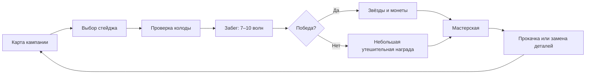

# Бамперы & Бестии — план Milestone 2: «Гаражная кампания»

Версия документа: 1.0  
Статус: готов к передаче в новый чистый чат  
Целевой стек: React 19 + TypeScript + Vite + PixiJS + Matter.js  
Ориентация: вертикальная, фиксированное логическое поле 720×1280  
Целевые платформы: мобильный и настольный браузер

---

## 1. Назначение документа

Этот документ — самостоятельная спецификация следующего milestone. Он должен позволить новому разработчику или AI-агенту открыть репозиторий и начать работу без повторного продуктового интервью.

Milestone превращает существующий одиночный vertical slice в небольшую законченную игру с:

- постоянным профилем игрока;
- мини-кампанией из 10 вручную созданных стейджей;
- тремя звёздами за качество прохождения;
- золотыми монетами как единственной мета-валютой;
- коллекцией деталей и активной колодой ровно из 8 деталей;
- постоянной числовой прокачкой деталей;
- повторным прохождением стейджей ради лучших звёзд и дополнительной валюты;
- отдельным экраном мастерской;
- полноценным циклом «кампания → подготовка → забег → награда → улучшение → следующий забег».

Документ содержит и продуктовые правила, и рекомендуемую техническую реализацию. Числовые значения экономики и баланса являются стартовыми конфигами: их можно менять после плейтестов без переписывания кода.

---

## 2. Что уже существует

Текущий прототип находится в корне репозитория и уже содержит:

- React 19, TypeScript и Vite;
- PixiJS для рендера;
- Matter.js для физики;
- один стейдж «Ржавый желудок»;
- 10 волн;
- пять типов врагов;
- восемь типов бамперов;
- фиксированные сокеты;
- строительство между волнами;
- выбор одной награды из трёх;
- реролл и «взять всё» за внутризабеговый лом;
- объединение одинаковых деталей до T3;
- ремонт базы как возможную награду при HP ≤ 50%;
- два режима раскладки управления флипперами;
- два режима движения флипперов;
- победу, поражение и расчёт звёзд;
- оригинальные спрайты и программные VFX;
- anti-stall защиту для физики;
- базовые unit-тесты и production-сборку.

Ключевые текущие файлы:

- `src/ui/App.tsx` — все React-экраны и оверлеи;
- `src/game/GameEngine.ts` — игровой цикл, PixiJS и Matter.js;
- `src/game/config.ts` — общий конфиг единственного стейджа;
- `src/game/types.ts` — базовые типы;
- `src/game/math.ts` — чистые игровые расчёты;
- `public/assets` — текущий арт.

Перед началом Milestone 2 необходимо считать текущий бой рабочей базой, а не переписывать его с нуля.

---

## 3. Продуктовое видение milestone

### 3.1. Основной fantasy

Игрок собирает и усиливает собственную машину для уничтожения орущих шарообразных чудовищ. В мета-слое он выбирает восемь деталей, вкладывает в них монеты и открывает новые модули. Внутри стейджа он строит из этой колоды конкретную конфигурацию машины и активно управляет флипперами.

Главный источник удовольствия остаётся прежним:

1. Придумать геометрию машины.
2. Увидеть, как врага перебрасывает по цепочке деталей.
3. Вовремя ударить флипперами и снова отправить его в машину.
4. Получить заметный рост мощности после забега.
5. Вернуться на сложный стейдж и пройти его лучше.

Мета не должна превращать игру в пассивное сравнение power score. Улучшения помогают, но тайминг флипперов и качество построения обязаны оставаться важными.

### 3.2. Целевая продолжительность

- Один стейдж: 5–7 минут успешного забега.
- Первая кампания без повторов: примерно 55–70 минут.
- Кампания с естественными поражениями, прокачкой и перепрохождениями: 90–150 минут.
- Одна мета-сессия между попытками: 20–60 секунд.

### 3.3. Основная петля



---

## 4. Зафиксированные продуктовые решения

Эти правила считаются согласованными и не должны самовольно меняться во время реализации.

### 4.1. Кампания

- Кампания состоит из 10 последовательных стейджей.
- Стейджи открываются по порядку.
- Для открытия следующего стейджа достаточно победить на текущем хотя бы с одной звездой.
- Уже пройденный стейдж можно запускать повторно без ограничений.
- Каждый стейдж — отдельный roguelite-забег.
- Каждый стейдж вручную авторится дизайнерами через конфиги.
- Процедурной генерации стейджей в milestone нет.
- У стейджей различаются:
  - фон и внешний вид автомата;
  - расположение сокетов;
  - статические препятствия;
  - предустановленные бамперы;
  - точки появления врагов;
  - состав, размер и ритм волн;
  - модификаторы сложности;
  - награды.
- Между стейджами может полностью меняться топология машины.

### 4.2. Звёзды

Качество прохождения определяется остатком HP базы на момент победы:

- 3 звезды: осталось не меньше 80% HP;
- 2 звезды: осталось не меньше 50% HP;
- 1 звезда: база жива, но осталось меньше 50% HP;
- 0 звёзд: поражение.

Лучший результат сохраняется отдельно для каждого стейджа. Повторное прохождение с худшим результатом не уменьшает уже полученные звёзды.

### 4.3. Валюты

В игре две разные экономики, их нельзя смешивать:

1. **Лом** — временная валюта внутри забега.
   - Сбрасывается в начале каждого стейджа.
   - Тратится на реролл, «взять всё» и другие внутризабеговые действия.
   - Не сохраняется в мету.

2. **Монеты** — постоянная soft currency.
   - Сохраняются между сессиями.
   - Выдаются после стейджа.
   - Тратятся только на постоянную прокачку деталей.
   - Premium currency, энергия и платежи отсутствуют.

### 4.4. Колода

- Активная колода всегда содержит ровно 8 деталей.
- В одной колоде не может быть двух одинаковых типов деталей.
- Стартовая коллекция содержит существующие восемь типов деталей, поэтому новая игра сразу имеет валидную колоду.
- По ходу кампании открываются ещё четыре типа деталей.
- Открытую деталь можно поставить в колоду вместо любой другой.
- Из драфтов внутри забега выпадают только детали активной колоды.
- Нельзя запустить стейдж с неполной или невалидной колодой.
- Соседство деталей не даёт скрытых бонусов.
- Синергия рождается из геометрии, физических цепочек и взаимодействия статусов.

### 4.5. Два независимых вида силы детали

У детали есть два независимых уровня:

1. **Мета-уровень** — постоянный уровень детали в коллекции.
   - Покупается за монеты.
   - Не сбрасывается.
   - Усиливает только числовые параметры.

2. **Тир внутри забега** — T1, T2 или T3.
   - Получается объединением копий во время конкретного стейджа.
   - Сбрасывается после завершения или выхода из забега.
   - Остаётся мощным множителем: T2 должен ощущаться минимум на 50% сильнее T1.

Нельзя называть мета-уровень «тиром» в коде или UI. Рекомендуемые термины:

- `level` — постоянная прокачка;
- `tier` — временное объединение внутри забега.

### 4.6. Ограничение перекоса прокачки

- Базовый уровень открытой детали — 1.
- Для milestone используется настраиваемый максимальный уровень 20.
- Следующий уровень выбранной детали нельзя купить, если после покупки он будет больше чем на 5 уровней выше самой непрокачанной открытой детали.
- Формально: `nextLevel <= minimumUnlockedLevel + 5`.
- Заблокированная кнопка обязана объяснять правило: «Сначала подтяни детали отстающие ниже Ур. N».
- Только открытые детали участвуют в вычислении минимального уровня.
- Новая деталь при открытии получает текущий минимальный уровень коллекции, но не меньше 1. Это не позволяет позднему анлоку внезапно заблокировать всю старую прокачку.

### 4.7. Прокачка

- Цена каждого следующего уровня всегда выше предыдущей.
- Апгрейды дают только числовые изменения.
- В milestone нет деревьев талантов, развилок, редкости, случайных аффиксов или эволюций.
- Экран до покупки показывает текущие и будущие значения.
- Покупка применяется сразу и сохраняется сразу.
- Отмена покупки и возврат монет в milestone не предусмотрены.

### 4.8. Управление и физика

- Поле остаётся вертикальным и фиксированным.
- В бою двигаются только флипперы и физические враги.
- Сокеты, бамперы и прочие препятствия статичны.
- Основной режим управления — один тап активирует оба флиппера.
- Альтернативные режимы «левая/правая половина» и «удержание» сохраняются.
- Физика остаётся предсказуемой.
- Случайность отскока бамперов — небольшой настраиваемый сектор, по умолчанию ±5° или меньше.
- Anti-stall защита обязательна для всех топологий.

---

## 5. Scope milestone

### 5.1. Обязательно входит

- Версионированное локальное сохранение.
- Профиль игрока и безопасная инициализация новой игры.
- Экран карты кампании из 10 стейджей.
- Состояния стейджа: закрыт, доступен, пройден.
- Отображение лучших звёзд.
- Preview наград до запуска.
- Экран мастерской.
- Коллекция минимум из 12 деталей: 8 текущих + 4 открываемых.
- Активная колода ровно из 8 уникальных деталей.
- Замена деталей в колоде.
- Постоянные уровни деталей.
- Растущие цены улучшений.
- Ограничение разрыва уровней в 5.
- Монеты и все операции с ними.
- Полные результаты победы и поражения.
- Выдача награды ровно один раз за завершённый забег.
- 10 вручную описанных стейджей.
- Минимум один финальный босс на стейдже 10.
- Отдельный арт/палитра для каждого стейджа.
- Арт четырёх новых деталей и босса.
- Онбординг первого запуска.
- Удаление служебных боевых кнопок из production UI.
- Unit-, integration- и browser-регрессия.

### 5.2. Не входит

- Процедурная генерация.
- Бесконечный режим.
- Daily/weekly challenges.
- Звук и музыка.
- Backend, аккаунты и облачные сохранения.
- Авторизация.
- Платежи, реклама и premium currency.
- Энергия или таймеры ожидания.
- LiveOps.
- Онлайн-лидерборды.
- Социальные функции.
- Несколько профилей.
- Встроенный редактор уровней.
- Встроенный редактор конфигов.
- Система достижений.
- Ветки сюжета и диалоги.

---

## 6. Пользовательские потоки

### 6.1. Первый запуск

1. Приложение не находит сохранение.
2. Создаётся `SaveDataV1`.
3. Игрок получает:
   - 0 монет;
   - восемь стартовых деталей уровня 1;
   - стартовую колоду из этих восьми деталей;
   - открытый стейдж 1;
   - закрытые стейджи 2–10.
4. Показывается короткий onboarding карты.
5. Игрок выбирает стейдж 1.
6. Перед стартом показывается карточка стейджа:
   - название;
   - количество волн;
   - типы врагов;
   - возможные награды за 1/2/3 звезды;
   - текущий лучший результат;
   - кнопки «Играть» и «Колода».

### 6.2. Победа

1. Игровой движок завершает бой и создаёт неизменяемый `RunResult`.
2. Мета-слой один раз применяет результат к сохранению.
3. Экран результата показывает:
   - количество заработанных звёзд;
   - сравнение с предыдущим рекордом;
   - заработанные монеты;
   - новый баланс;
   - открытый следующий стейдж;
   - новую деталь, если она была наградой;
   - итоговый счёт и HP базы.
4. Доступные действия:
   - «Следующий стейдж»;
   - «Ещё раз»;
   - «В мастерскую»;
   - «На карту».

### 6.3. Поражение

1. Игрок получает небольшую утешительную награду монетами.
2. Новые звёзды и следующий стейдж не открываются.
3. Экран показывает:
   - достигнутую волну;
   - полученные монеты;
   - подсказку усилить одну из слабых деталей;
   - кнопки «Ещё раз», «В мастерскую», «На карту».

Подсказка не должна автоматически выбирать «правильную» деталь или обещать, что power решит проблему. Она лишь ведёт игрока в мету.

### 6.4. Мастерская

1. Сверху постоянно виден баланс монет.
2. В верхней половине — восемь слотов активной колоды.
3. Ниже — коллекция всех открытых и будущих деталей.
4. Закрытые детали видны силуэтами с условием открытия.
5. Тап по детали открывает detail panel:
   - арт;
   - название и роль;
   - уровень;
   - текущие числовые параметры;
   - значения после улучшения;
   - цена;
   - кнопка улучшения;
   - состояние «в колоде» или кнопка замены.
6. Замена выполняется в два шага:
   - выбрать открытую деталь вне колоды;
   - выбрать слот, который она заменит;
   - подтвердить результат.
7. Изменение колоды сохраняется немедленно.

---

## 7. Кампания из 10 стейджей

Все названия и числа ниже являются рабочим content lock для milestone. Они лежат в конфиге и допускают балансировку, но не требуют нового продуктового решения.

| № | Название | Топология и тема | Основной урок | Ключевые враги | Ожидаемый средний уровень колоды |
|---:|---|---|---|---|---:|
| 1 | Ржавый желудок | Текущее широкое поле, 10 сокетов, один встроенный базовый бампер | Базовый ритм, флипперы и строительство | Крикун, Пискля, Жиробас, Ракетчик, Мамочка | 1 |
| 2 | Двойной желоб | Два боковых канала, 9 сокетов, открытый центр | Контроль горизонтального направления | Пискля, Крикун | 1–2 |
| 3 | Бронепресс | Узкий центр и две диагональные направляющие, 8 сокетов | Сильные удары против брони | Жиробас, Крикун | 2 |
| 4 | Ракетная кишка | Открытая верхняя половина, три разнесённых spawn-gate | Реакция на телеграф ускорения | Ракетчик, Пискля | 2 |
| 5 | Маточный цех | Центральный остров, 10 сокетов вокруг него | Контроль большого количества тел | Мамочка, Крикун, Пискля | 2–3 |
| 6 | Ледяной слив | Зигзагообразные статические рельсы, 8 сокетов | Планирование длинных цепочек | Жиробас, Ракетчик | 3 |
| 7 | Токсичный отстойник | Верхняя воронка, два безопасных боковых выхода, 9 сокетов | Урон в обход брони и коррозия | Жиробас, смешанные пачки | 3 |
| 8 | Динамо-утроба | Три вертикальные зоны и центральный встроенный Шокер, 10 сокетов | Кластеризация и цепной урон | Пискля, Мамочка | 3–4 |
| 9 | Собор металлолома | Разреженные сокеты, длинные опасные траектории, встроенный Бабах | Точный тайминг и использование кончика флиппера | Все обычные типы | 4 |
| 10 | Пасть Начальника | Широкая арена босса, 10 сокетов, минимум безопасных рельсов | Проверка всей системы | Босс + призываемые миньоны | 4–5 |

### 7.1. Общие требования к стейджам

- Каждый стейдж содержит 7–10 волн. Для первого content pass рекомендуется 10 волн на стейдж, затем сокращать только по данным длительности.
- Первая волна создаёт пространство для освоения топологии.
- На волнах 3–4 появляется основная тема стейджа.
- Волны 6–8 проверяют собранную машину плотными пачками.
- Последняя волна — кульминация, но не должна длиться больше 70–90 секунд.
- Между волнами всегда есть фаза строительства.
- Перед первой волной игрок получает один выбор из трёх и ставит одну деталь.
- Реролл сбрасывает свою цену после каждой волны.
- «Взять всё» остаётся дорогой внутризабеговой опцией.
- Ремонт может появиться только при HP базы ≤ 50%.
- Боковые сокеты обязаны проходить автоматическую проверку геометрического зазора для самого большого врага и самого большого бампера.
- В любой точке поля должен существовать физический выход вниз или anti-stall должен гарантированно разрешать ситуацию.

### 7.2. Структура волны

Текущий `EnemyKind[]` недостаточен для десяти разных стейджей. Нужен декларативный формат событий:

```ts
interface SpawnEventConfig {
  atMs: number;
  enemy: EnemyKind;
  gate: string;
  count?: number;
  intervalMs?: number;
  velocity?: { x: number; y: number };
  hpMultiplier?: number;
}

interface WaveConfig {
  id: string;
  label?: string;
  events: SpawnEventConfig[];
  clearDelayMs?: number;
}
```

Это позволяет вручную задавать:

- одиночные падения;
- мелкие пачки;
- чередование spawn-gate;
- почти одновременный хаотичный заход;
- короткие паузы перед элитным врагом;
- специальные boss-события.

### 7.3. Босс стейджа 10

Рабочее имя: **Главшар**.

Босс остаётся круглым физическим телом, а не отдельной scripted-сценой.

Базовые свойства:

- крупный радиус;
- большая масса;
- постоянный заметный HP-bar;
- три визуальные стадии повреждения;
- броня с обычным плоским вычитанием;
- собственный урон базе;
- невосприимчивость к мгновенному убийству ямой: яма наносит процентный урон с внутренним cooldown;
- пониженная длительность заморозки;
- яд по-прежнему проходит сквозь броню и разъедает её.

Способности:

1. **Призыв миньонов** — раз в 5–7 секунд вызывает 2–3 Пискли или Крикуна из верхних gate.
2. **Разгон вниз** — короткий яркий телеграф 600–800 ms, затем ускорение в сторону базы.
3. **Фаза ярости** — при 35% HP сокращает cooldown способностей и меняет визуальную стадию.

Все способности конфигурируются численно. Босс не должен игнорировать физику или телепортироваться без телеграфа.

---

## 8. Новые открываемые детали

Стартовые восемь деталей остаются без изменений по роли:

- Дубина;
- Поджигатель;
- Бабах;
- Морозилка;
- Точило;
- Шокер;
- Жор-Яма;
- Токсик.

Для осмысленного выбора колоды каталог расширяется до 12 типов.

### 8.1. Притягатель

- Unlock: первая победа на стейдже 2.
- Роль: группировка врагов для взрывов и цепного урона.
- Низкий прямой урон.
- Средне-слабый отскок.
- При контакте коротко притягивает ближайших врагов к точке удара.
- Эффект не зависит от соседства с другими деталями.
- Числовые параметры прокачки: урон, радиус, сила притяжения, cooldown.

### 8.2. Карусель

- Unlock: первая победа на стейдже 4.
- Роль: изменение маршрута.
- Средний урон и средний отскок.
- Добавляет врагу фиксированный тангенциальный импульс по часовой стрелке.
- Игрок не вращает и не настраивает направление детали.
- Числовые параметры прокачки: урон, тангенциальная сила, отскок, cooldown.

### 8.3. Пружинный псих

- Unlock: первая победа на стейдже 6.
- Роль: максимальная транспортировка врага.
- Низкий урон.
- Самая высокая сила отскока в игре.
- Имеет заметный cooldown, в который работает как слабый физический объект.
- Числовые параметры прокачки: урон, сила отскока, сокращение cooldown.

### 8.4. Мясорубка

- Unlock: первая победа на стейдже 8.
- Роль: удержание врага в зоне стабильного урона.
- Очень слабый отскок.
- Наносит несколько небольших тиков урона при продолжительном контакте.
- Не наносит урон в обход брони.
- Для `collisionActive` должен существовать отдельный per-enemy cooldown, чтобы эффект не зависел от FPS.
- Числовые параметры прокачки: урон тика, частота тика, слабая сила отскока.

### 8.5. Общие правила новых деталей

- Каждая деталь обязана наносить хотя бы какой-то урон.
- Особое свойство компенсируется сниженным прямым DPS, cooldown или сложностью маршрута.
- Никаких бонусов от соседства.
- Каждая имеет собственный `bounce`.
- Каждая имеет уникальный, полноценно отрисованный sprite.
- Для каждого эффекта нужны ясный телеграф, hit-VFX и cooldown-состояние.
- Новая деталь при открытии автоматически добавляется в коллекцию, но не меняет активную колоду без решения игрока.

---

## 9. Экономика монет

### 9.1. Принципы

- Игрок после поражения всегда видит путь к небольшому усилению.
- Повторное прохождение ранее открытого стейджа приносит монеты.
- Нельзя навсегда застрять без доступного источника валюты.
- Повторное прохождение ранних стейджей допустимо, но продвижение вперёд выгоднее по времени.
- Все награды видны до запуска стейджа.
- В milestone нет скрытых множителей награды.

### 9.2. Награда за звёзды

Каждая звезда имеет отдельную цену. Итоговая награда за победу — сумма заработанных звёзд текущего забега. Награда повторяемая, а не только first-time.

| Стейдж | 1-я звезда | 2-я звезда | 3-я звезда | Всего за 3★ | Поражение |
|---:|---:|---:|---:|---:|---:|
| 1 | 15 | 20 | 25 | 60 | 4 |
| 2 | 18 | 24 | 30 | 72 | 5 |
| 3 | 22 | 29 | 36 | 87 | 6 |
| 4 | 26 | 34 | 42 | 102 | 7 |
| 5 | 30 | 40 | 50 | 120 | 8 |
| 6 | 35 | 46 | 57 | 138 | 9 |
| 7 | 40 | 53 | 66 | 159 | 10 |
| 8 | 46 | 61 | 76 | 183 | 12 |
| 9 | 53 | 70 | 87 | 210 | 14 |
| 10 | 60 | 80 | 100 | 240 | 16 |

Результат 2★ на стейдже 4 даёт `26 + 34 = 60` монет.

### 9.3. Награда за поражение

- Поражение даёт фиксированную сумму из таблицы стейджа.
- Награда не зависит от количества намеренно пропущенных врагов.
- Для UX экран может показать достигнутую волну, но она не умножает выплату в первом балансе.
- Один `runId` может быть применён к профилю только один раз.

### 9.4. Цена улучшения

У каждого типа детали есть базовая стоимость. Цена перехода с текущего уровня `L` на `L + 1`:

```ts
upgradeCost = roundToNearest5(baseUpgradeCost * 1.38 ** (L - 1));
```

Рабочие базовые цены:

| Деталь | Base cost |
|---|---:|
| Дубина | 25 |
| Поджигатель | 30 |
| Бабах | 38 |
| Морозилка | 30 |
| Точило | 35 |
| Шокер | 38 |
| Жор-Яма | 50 |
| Токсик | 35 |
| Притягатель | 42 |
| Карусель | 38 |
| Пружинный псих | 42 |
| Мясорубка | 45 |

Цена всегда должна строго расти. Unit-тест обязан проверять монотонность для уровней 1–20.

### 9.5. Стартовая ожидаемая кривая

- После первой победы игрок обычно может купить один недорогой уровень или накопить на дорогой.
- При прохождении стейджей на 2★ игрок получает примерно 802 монеты за всю кампанию без повторов.
- Этого должно хватать примерно на:
  - прокачку стартовой колоды до среднего уровня 2–3;
  - несколько приоритетных деталей до уровня 4–5;
  - эксперименты с одной-двумя новыми деталями.
- Стейдж 10 должен быть проходим колодой среднего уровня 4 при хорошем управлении.
- Средний уровень 5 должен давать комфортный, но не автоматический проход.

Эти утверждения — балансировочные цели, а не жёсткие блокировки запуска.

---

## 10. Формулы постоянной прокачки

### 10.1. Общая модель

Каждый тип детали имеет собственный `UpgradeProfile`. Нельзя умножать все параметры одним глобальным коэффициентом: bounce, cooldown и радиусы требуют разных ограничений.

```ts
interface StatGrowth {
  mode: 'linear' | 'multiplicative' | 'inverse';
  perLevel: number;
  cap?: number;
  floor?: number;
}

interface BumperUpgradeProfile {
  baseUpgradeCost: number;
  damage?: StatGrowth;
  bounce?: StatGrowth;
  cooldownMs?: StatGrowth;
  effectStrength?: StatGrowth;
  effectRadius?: StatGrowth;
}
```

Рекомендуемый первый pass:

- урон: +10% от базового значения за уровень;
- особый эффект: +6% за уровень;
- сила отскока: +1.25% за уровень, максимум +20%;
- cooldown: −1.5% за уровень, максимум −25%;
- радиус физического collider не меняется от уровня;
- визуальный размер не меняется от уровня;
- стоимость ремонта базы не относится к прокачке деталей.

### 10.2. Порядок вычисления силы в забеге

```ts
effectiveDamage = baseDamage
  * metaLevelDamageMultiplier(level)
  * runTierMultiplier(tier);
```

Порядок обязателен для читаемости и тестов:

1. взять базовый конфиг типа;
2. применить постоянный мета-уровень;
3. применить временный T1/T2/T3;
4. применить ситуационные правила столкновения;
5. вычесть броню, если источник не обходит её.

Текущие множители тира сохраняются стартово:

- T1: ×1.00;
- T2: ×1.55;
- T3: ×2.45.

### 10.3. Что не улучшается

- Размер физического тела.
- Позиция сокета.
- Направление специального импульса.
- Правила статуса.
- Максимальный тир внутри забега.
- Состав драфта.
- Шанс выпадения.

---

## 11. Архитектура данных

### 11.1. Структура контента

Рекомендуемая декомпозиция:

```text
src/
  content/
    bumpers.ts
    enemies.ts
    economy.ts
    progression.ts
    stages/
      stage-01.ts
      stage-02.ts
      ...
      stage-10.ts
      index.ts
  game/
    GameEngine.ts
    RunController.ts
    physics/
    systems/
    types.ts
  meta/
    profileTypes.ts
    createDefaultProfile.ts
    ProfileStore.ts
    SaveGateway.ts
    migrations.ts
    economy.ts
    deck.ts
    progression.ts
  ui/
    App.tsx
    screens/
      CampaignScreen.tsx
      StageDetailsScreen.tsx
      WorkshopScreen.tsx
      GameScreen.tsx
      ResultScreen.tsx
    components/
```

Не нужно механически дробить `GameEngine.ts` раньше, чем появятся реальные границы систем. Обязательное разделение milestone:

- движок не знает о `localStorage`;
- движок не начисляет мета-монеты;
- React/UI не вычисляет физический урон;
- конфиги стейджей не хранят runtime-состояние;
- экономика реализуется чистыми функциями;
- все записи профиля проходят через один store/gateway.

### 11.2. Конфиг стейджа

```ts
interface StageConfig {
  id: StageId;
  order: number;
  name: string;
  subtitle: string;
  tableArt: string;
  mapArt: string;
  theme: {
    primary: number;
    secondary: number;
    danger: number;
  };
  sockets: SocketConfig[];
  obstacles: ObstacleConfig[];
  builtInBumpers: BuiltInBumperConfig[];
  spawnGates: SpawnGateConfig[];
  waves: WaveConfig[];
  rewards: {
    starCoins: [number, number, number];
    defeatCoins: number;
    unlockBumper?: BumperKind;
  };
  recommendedAverageLevel: number;
  enemyTuning?: {
    hpMultiplier?: number;
    armorBonus?: number;
    spawnIntervalMultiplier?: number;
  };
}
```

`StageConfig` передаётся в `GameEngine` при создании забега. Движок не импортирует глобальный `SOCKETS` или `WAVES`.

### 11.3. Параметры запуска

```ts
interface RunLoadout {
  stageId: StageId;
  seed: number;
  deck: Array<{
    kind: BumperKind;
    level: number;
  }>;
  inputLayout: InputLayout;
  flipperMotion: FlipperMotion;
}
```

Колода и уровни копируются в `RunLoadout` в момент старта. Покупка улучшения в другой вкладке не должна менять уже запущенный забег.

### 11.4. Результат забега

```ts
interface RunResult {
  runId: string;
  stageId: StageId;
  outcome: 'victory' | 'defeat' | 'abandoned';
  stars: 0 | 1 | 2 | 3;
  baseHp: number;
  maxBaseHp: number;
  score: number;
  reachedWave: number;
  totalWaves: number;
  durationMs: number;
  seed: number;
  deckSnapshot: Array<{ kind: BumperKind; level: number }>;
}
```

- `GameEngine` создаёт `RunResult`.
- `ProfileStore.applyRunResult()` вычисляет и начисляет награды.
- `abandoned` не приносит монет.
- Один `runId` нельзя применить дважды.

---

## 12. Сохранение

### 12.1. Формат

Ключ localStorage:

```text
bumpers-and-beasts.profile.v1
```

```ts
interface SaveDataV1 {
  schemaVersion: 1;
  revision: number;
  createdAt: string;
  updatedAt: string;
  coins: number;
  unlockedBumpers: BumperKind[];
  bumperLevels: Partial<Record<BumperKind, number>>;
  activeDeck: BumperKind[];
  stages: Record<StageId, StageProgress>;
  appliedRunIds: string[];
  settings: {
    inputLayout: InputLayout;
    flipperMotion: FlipperMotion;
    haptics: boolean;
  };
  onboarding: {
    campaignSeen: boolean;
    workshopSeen: boolean;
    firstUpgradeBought: boolean;
  };
  lifetimeStats: {
    runsStarted: number;
    victories: number;
    defeats: number;
    coinsEarned: number;
    coinsSpent: number;
    totalPlayTimeMs: number;
  };
}

interface StageProgress {
  unlocked: boolean;
  bestStars: 0 | 1 | 2 | 3;
  bestBaseHp: number;
  bestScore: number;
  completions: number;
  attempts: number;
}
```

### 12.2. Требования к SaveGateway

- Парсить сохранение через runtime-validation, а не через слепой type cast.
- При отсутствии данных создавать default profile.
- При частично повреждённых данных восстанавливать валидные поля и сохранять резервную копию сырой строки под ключом `bumpers-and-beasts.profile.corrupt.<timestamp>`.
- Никогда не создавать отрицательный баланс.
- Удалять неизвестные или повторяющиеся элементы из колоды.
- Восстанавливать колоду до восьми элементов из открытой коллекции.
- Clamp уровней в диапазон 1–20.
- Ограничивать `appliedRunIds` последними 100 идентификаторами.
- Увеличивать `revision` при каждой записи.
- Записывать профиль сразу после покупки, замены колоды и применения результата.
- Слушать событие `storage`; при более новой `revision` обновлять UI.
- Не сохранять незаконченный забег в milestone.
- Refresh во время боя считается abandon и не даёт награды.

### 12.3. Миграции

Даже первая версия должна иметь точку расширения:

```ts
type Migration = (unknownSave: unknown) => unknown;

const migrations: Record<number, Migration> = {
  // 1 -> 2 появится в будущем
};
```

`schemaVersion` нельзя менять вручную без миграции и теста fixture старой версии.

---

## 13. Экранная архитектура

### 13.1. Состояния приложения

```ts
type AppScreen =
  | { name: 'boot' }
  | { name: 'campaign' }
  | { name: 'stage-details'; stageId: StageId }
  | { name: 'workshop'; returnTo?: AppScreen }
  | { name: 'game'; run: RunLoadout }
  | { name: 'result'; result: RunResult; reward: AppliedRunReward };
```

React Router для milestone не обязателен. Достаточно типизированной state machine, если browser back не является продуктовым требованием.

### 13.2. Карта кампании

- Вертикальный маршрут из десяти крупных узлов.
- Карта скроллится и автоматически фокусируется на последнем доступном непройденном стейдже.
- Узел показывает:
  - номер;
  - название;
  - 0–3 лучших звезды;
  - состояние lock;
  - иконку новой детали, если она открывается здесь.
- Закрытый узел доступен для просмотра, но кнопка запуска заблокирована.
- Верхняя панель:
  - баланс монет;
  - кнопка мастерской;
  - общий прогресс звёзд `X/30`.
- Стейдж 10 визуально выделяется как boss-node.

### 13.3. Карточка стейджа

- Название и номер.
- Превью игрового поля.
- Количество волн.
- Иконки встречающихся врагов.
- Лучшие звёзды и лучший счёт.
- Три заранее показанные награды монетами.
- Награда новой деталью, если есть.
- Рекомендуемый средний уровень — информационно, не как hard gate.
- Кнопки:
  - «Играть»;
  - «Колода»;
  - «Назад».

### 13.4. Экран результата

Порядок анимации:

1. Исход победы или поражения.
2. Заполнение звёзд слева направо.
3. Count-up заработанных монет.
4. Новый баланс.
5. Badge `НОВЫЙ РЕКОРД`, если улучшены звёзды, HP или счёт.
6. Unlock reveal новой детали.
7. Появление кнопок.

Повторный tap может ускорить анимацию, но не повторно применить награду.

### 13.5. Служебные элементы

Кнопки `+ ВРАГ`, `✓ ВОЛНА`, `ТЕСТ БАЗЫ`:

- доступны только при `import.meta.env.DEV`;
- не занимают место в production layout;
- не попадают в production DOM;
- не могут начислять мета-награды, если забег помечен как debug.

---

## 14. Арт и визуальная подача

### 14.1. Общие требования

- Сохраняется мультяшный junkyard/body-horror arcade стиль без реализма.
- Никаких emoji или текстовых символов вместо арта.
- Враги остаются круглыми, смешными и выразительными.
- UI читается на 390×844 одной рукой.
- Текст не должен быть запечён в AI-generated raster assets.
- Все важные подписи рендерятся HTML/CSS или Pixi Text.
- Игровое поле может быть слегка показано под углом как корпус автомата, но физическая область должна читаться сверху.

### 14.2. Нужные новые ассеты

- 9 новых table backgrounds для стейджей 2–10;
- 10 map-node illustrations или один модульный набор рамок + 10 thumbnails;
- 4 прозрачных sprites новых деталей;
- sprite босса с минимум тремя стадиями повреждения;
- иконка золотой монеты;
- мастерская/гаражный фон;
- silhouette/lock presentation закрытых деталей;
- VFX-текстуры только если программных частиц недостаточно.

### 14.3. Технические требования к ассетам

- Бамперы и враги: квадратный PNG/WebP с настоящим alpha.
- Исходная генерация: минимум 1024×1024.
- Runtime-копия: оптимизированный размер 256–512 px по большей стороне.
- Table art: исходник 720×1280 или кратное разрешение с тем же aspect ratio.
- Проверить отсутствие ложного шахматного фона.
- Проверить sprite silhouette на тёмном поле и на ярком VFX.
- Не использовать удалённые URL в runtime.

---

## 15. Технический план по итерациям

После каждой итерации обязательно выполняются:

1. `npm test`.
2. `npm run build`.
3. Browser smoke-test на desktop viewport.
4. Browser smoke-test на 390×844.
5. Проверка console errors/warnings.
6. Оценка:
   - качество кода;
   - UX;
   - игровой баланс;
   - визуальное качество;
   - производительность;
   - обнаруженные баги.
7. Исправление blocker/high bugs до перехода к следующей итерации.

### Итерация 0. Baseline и страховочная сетка

Цель: зафиксировать работающий прототип перед большим рефакторингом.

Работы:

- записать существующий combat smoke-test;
- добавить тесты расчёта звёзд и run result;
- спрятать debug controls за DEV;
- добавить единый `StageId`;
- зафиксировать текущий стейдж как `stage-01` без изменения поведения;
- создать baseline screenshots для menu/build/combat/result;
- подтвердить отсутствие regression в anti-stall.

Gate:

- stage-01 играется так же, как до начала milestone;
- production build не содержит debug controls;
- все текущие тесты зелёные.

### Итерация 1. Content domain и инъекция StageConfig

Цель: отвязать движок от одного глобального стейджа.

Работы:

- вынести enemy и bumper configs;
- создать `StageConfig`, `WaveConfig`, spawn events;
- перенести текущие сокеты, препятствия, фон и волны в `stage-01.ts`;
- передавать конфиг через constructor/factory `GameEngine`;
- заменить прямые импорты `SOCKETS/WAVES` на runtime stage data;
- добавить config validation;
- добавить geometry-clearance tests.

Gate:

- stage-01 полностью проходим;
- порядок спавна совпадает с новым конфигом;
- не осталось скрытых ссылок на единственный стейдж.

### Итерация 2. Профиль, сохранение и экономика

Цель: безопасно хранить прогресс и монеты.

Работы:

- реализовать типы профиля;
- default profile;
- runtime validation;
- SaveGateway;
- ProfileStore;
- версионирование и repair повреждённых данных;
- чистые функции `calculateRunReward`, `upgradeCost`, `canUpgrade`;
- idempotent `applyRunResult`;
- тесты duplicate runId, negative balance, corrupt save, deck repair;
- local dev reset profile action, скрытый из production.

Gate:

- refresh сохраняет монеты, уровни, колоду и звёзды;
- двойное нажатие/повторный render результата не дублирует выплату;
- повреждённый save не оставляет приложение на белом экране.

### Итерация 3. Карта кампании и запуск стейджа

Цель: заменить стартовый экран полноценным campaign shell.

Работы:

- CampaignScreen;
- 10 node states;
- StageDetailsScreen;
- preview rewards;
- lock/unlock progression;
- общий счётчик звёзд;
- сохранение выбранных control settings;
- переходы campaign → details → game → campaign;
- placeholder-конфиги десяти стейджей с валидными topology IDs.

Gate:

- новая игра видит только stage-01 доступным;
- победа на stage-01 открывает stage-02;
- поражение не открывает stage-02;
- прошлый стейдж можно переиграть.

### Итерация 4. Мастерская и колода

Цель: закрыть полный мета-цикл.

Работы:

- WorkshopScreen;
- восемь deck slots;
- collection grid;
- locked silhouettes;
- swap flow;
- detail panel;
- upgrade preview;
- покупка уровня;
- правило разницы в 5 уровней;
- формулы уровня для всех текущих деталей;
- передача уровней в RunLoadout;
- применение уровней в расчётах боя.

Gate:

- невозможно создать колоду не из восьми уникальных открытых деталей;
- покупка списывает точную цену один раз;
- следующий забег использует новые статы;
- временный tier и постоянный level не смешиваются.

### Итерация 5. Драфт как настоящая колода

Цель: сделать выбор мета-колоды наблюдаемым в забеге.

Работы:

- драфт использует только восемь активных типов;
- реализовать shuffle-bag с seed;
- выдавать три разных типа без повторов в одном предложении;
- реролл сбрасывает текущие карты и берёт следующие;
- при исчерпании bag перемешивается заново;
- repair временно добавляется в pool только при HP ≤ 50%;
- зафиксировать поведение `take all`;
- добавить deterministic tests по seed.

Gate:

- деталь вне колоды не появляется в 1000 тестовых драфтов;
- каждая деталь колоды регулярно появляется;
- одинаковый seed и одинаковые действия дают одинаковую последовательность.

### Итерация 6. Стейджи 2–5 и первые две новые детали

Цель: доказать, что content pipeline масштабируется.

Работы:

- финальные topology configs stage-02…05;
- authored wave configs;
- арт четырёх столов;
- Притягатель;
- Карусель;
- unlock flow;
- VFX и cooldown presentation;
- баланс длительности и наград.

Gate:

- каждый стейдж визуально и физически отличим;
- нет неразрешимых карманов;
- каждая новая деталь имеет реальный trade-off;
- первый проход stage-01…05 укладывается в ожидаемую кривую.

### Итерация 7. Стейджи 6–9 и ещё две детали

Цель: завершить основную кампанию до босса.

Работы:

- topology и wave configs stage-06…09;
- четыре table artworks;
- Пружинный псих;
- Мясорубка;
- `collisionActive` system с FPS-independent cooldown;
- unlock flow;
- расширенная регрессия нагрузки множеством врагов.

Gate:

- stage-06…09 проходимы несколькими колодами;
- Мясорубка не наносит больше тиков на 120 Hz, чем на 60 Hz;
- сильный отскок Пружинного психа не создаёт tunneling или вечных орбит.

### Итерация 8. Финальный стейдж и босс

Цель: создать кульминацию mini-campaign.

Работы:

- stage-10 topology;
- boss enemy config и sprite stages;
- boss health UI;
- minion summon;
- telegraphed downward dash;
- rage phase;
- особые правила ямы, льда и яда;
- victory presentation кампании;
- возврат на карту после финала.

Gate:

- все способности имеют читаемый телеграф;
- босс остаётся физическим объектом;
- нет one-shot от ямы;
- бой не зависит от невидимых scripted-исключений;
- stage-10 завершается корректным 1–3★ result.

### Итерация 9. Онбординг, polish и full regression

Цель: довести milestone до состояния законченной мини-игры.

Работы:

- onboarding карты и мастерской;
- result animation;
- coin count-up;
- unlock reveal;
- все состояния пустых/закрытых/недоступных кнопок;
- responsive pass;
- performance profiling;
- оптимизация ассетов;
- полный баланс экономики;
- прохождение кампании с чистого save;
- повторное прохождение после завершения;
- финальная accessibility и input проверка.

Gate:

- нет blocker/high дефектов;
- clean-save campaign можно завершить;
- refresh безопасен на каждом meta-screen;
- production console чистая;
- мобильный layout не имеет overflow;
- пользователь вручную подтверждает субъективный критерий fun.

---

## 16. Тестовая стратегия

### 16.1. Unit-тесты

Обязательные чистые функции:

- `starsForHp`;
- `calculateRunReward`;
- `upgradeCost` уровней 1–20;
- `canUpgrade` и правило `min + 5`;
- `applyLevelToBumperStats`;
- `applyTierToLeveledStats`;
- `createDefaultProfile`;
- `repairProfile`;
- `unlockNextStage`;
- `unlockBumper`;
- `validateDeck`;
- seeded shuffle-bag;
- run result idempotency;
- geometry clearance;
- anti-stall predicate;
- boss status modifiers.

### 16.2. Integration-тесты

- Первая победа stage-01 начисляет монеты и открывает stage-02.
- Повторное применение того же `runId` ничего не начисляет.
- Повторная честная победа с новым `runId` начисляет повторяемую награду.
- Худшие звёзды не затирают лучший результат.
- Лучшие звёзды обновляют record.
- Поражение выдаёт только defeat reward.
- Покупка уровня меняет save и balance.
- Недостаток монет блокирует покупку.
- Level-gap блокирует покупку.
- Unlock новой детали выдаёт ей текущий минимальный уровень.
- Swap сохраняет ровно восемь уникальных типов.
- Refresh восстанавливает UI на основе save.

### 16.3. Browser/E2E матрица

Минимальный набор реальных потоков:

1. Чистый профиль → stage-01 → поражение → монеты → мастерская.
2. Чистый профиль → победа 1★ → открытие stage-02.
3. Победа 3★ → правильная сумма трёх наград.
4. Повторная победа → повторяемая выплата без изменения bestStars вниз.
5. Upgrade → refresh → уровень сохранён.
6. Swap детали → запуск → в драфте только новая колода.
7. Unlock новой детали → reveal → swap → появление в забеге.
8. Завершение stage-10 → финальный экран → карта 30-star progress.
9. Повреждённый localStorage → безопасное восстановление.
10. Double-click result/upgrade → отсутствие двойной операции.

Viewports:

- 390×844 — основной мобильный;
- 360×800 — узкий мобильный;
- 430×932 — крупный мобильный;
- 1280×720 — desktop landscape с вертикальной машиной по центру;
- 1440×900 — desktop.

### 16.4. Физическая регрессия каждого стейджа

- Idle-run без тапов завершается поражением или потерей значимого HP, а не автоматической идеальной победой.
- Active-run с хорошими тапами статистически лучше idle-run.
- Все враги в stress-wave покидают поле, погибают или достигают базы.
- Ни один крупный враг не застревает между крайним бампером и стеной.
- Враг не улетает навсегда выше/левее/правее физического мира.
- Нет бесконечных орбит.
- Tunneling через флипперы не становится регулярным.
- Boss/minion wave корректно завершается.

---

## 17. Performance budget

Цели для современного среднего мобильного браузера:

- 60 FPS в обычном бою;
- не ниже 45 FPS в кратком пике массового VFX;
- максимум 20 одновременно живых обычных врагов без деградации управления;
- максимум 250 активных частиц;
- отсутствие постоянного роста `particles`, bodies, textures и timers между стейджами;
- уничтожение Pixi containers и Matter bodies при выходе;
- lazy-load игрового движка сохраняется;
- lazy-load table art следующего стейджа допускается после открытия details panel;
- стартовый campaign bundle не должен тянуть все 10 полноразмерных table backgrounds;
- raster assets оптимизируются до разумного веса;
- не допускаются сетевые зависимости runtime.

Performance regression:

- записать количество Matter bodies, Pixi children и активных timers до и после пяти последовательных запусков;
- после выхода на карту значения должны возвращаться к baseline;
- профилировать stage-05 и stage-10 как самые тяжёлые сценарии.

---

## 18. Телеметрия для локальных плейтестов

Backend не нужен. Для оценки milestone достаточно локальных counters и выгружаемого dev-summary в консоль.

Полезные события:

- запуск/завершение стейджа;
- outcome, stars, base HP, duration;
- достигнутая волна;
- состав и уровни колоды;
- выбранные run upgrades;
- потраченный лом;
- купленные meta-upgrades;
- замены в колоде;
- количество anti-stall rescue;
- средний FPS и минимальный FPS;
- причина поражения по последним пропущенным врагам.

Эти данные помогают балансировать. Окончательная субъективная оценка fun остаётся за владельцем проекта.

---

## 19. Definition of Done milestone

Milestone считается готовым только при выполнении всех условий.

### Продукт

- Есть 10 доступных по цепочке стейджей.
- Все 10 стейджей имеют отличимую топологию и оформление.
- Есть полноценный финальный босс.
- Карта, мастерская, бой и результаты образуют замкнутую петлю.
- Монеты зарабатываются и тратятся.
- Колода меняется и реально влияет на драфт.
- Уровни меняют числовые характеристики боя.
- Игрок может перепроходить стейджи и улучшать звёзды.

### Надёжность

- Сохранение переживает refresh и перезапуск браузера.
- Повреждённое сохранение восстанавливается.
- Награда не дублируется.
- Баланс не становится отрицательным.
- Невалидная колода автоматически ремонтируется.
- Нет blocker/high bugs.
- Нет воспроизводимых soft-lock физики.

### Качество

- Production build проходит.
- Все automated tests проходят.
- Production console не содержит ошибок.
- Все основные user flows проверены в браузере.
- UI читаем на целевых мобильных размерах.
- Нет emoji/text placeholders вместо финального арта.
- Debug controls отсутствуют в production.
- Нет звука, поскольку он вне согласованного scope.

### Баланс

- Stage-01 проходим на level-1 deck.
- Stage-10 проходим на average level 4 при хорошем управлении.
- Игрок не обязан фармить один конкретный стейдж.
- Хотя бы три существенно разные колоды способны завершить кампанию.
- Хорошее управление заметно улучшает результат относительно idle.
- Ни одна деталь не является обязательной для каждого стейджа.

---

## 20. Риски и способы снижения

### Риск: монолитный GameEngine замедлит добавление контента

Решение: сначала инъекция `StageConfig` и выделение чистых систем, затем контент. Не проводить полный архитектурный rewrite.

### Риск: мета-power уничтожит skill expression

Решение: умеренные level-множители, рекомендованный уровень без hard gate, постоянные idle-vs-active сравнения.

### Риск: 10 стейджей ощущаются одинаково

Решение: уникальная топология, spawn cadence, built-ins, новые детали и boss; не полагаться только на HP multiplier.

### Риск: поздно открытая деталь блокирует level-gap

Решение: новая деталь получает текущий minimum unlocked level.

### Риск: повторяемая награда ломает экономику

Решение: растущие цены, reward-per-minute выше на поздних стейджах, конфиг-driven баланс и economy simulation.

### Риск: повторная обработка result выдаёт монеты несколько раз

Решение: immutable `runId`, capped ledger применённых run ID и единая транзакция ProfileStore.

### Риск: новые топологии создают физические капканы

Решение: geometry validation, anti-stall, stress-run каждого стейджа с крупными врагами и максимальными бамперами.

### Риск: объём арта задержит код

Решение: сначала topology с временным цветовым оформлением, затем финальные ассеты до content gate; placeholder art не допускается в финальной сдаче.

---

## 21. Порядок работы в новом чате

Новый чат должен действовать так:

1. Полностью прочитать этот документ.
2. Осмотреть текущий репозиторий и запустить baseline tests/build.
3. Не использовать Phaser.
4. Не добавлять звук.
5. Не добавлять procedural generation, endless mode или challenges.
6. Не начинать с создания всех десяти стейджей.
7. Реализовывать итерации строго по порядку.
8. После каждой итерации выполнять QA-gate из раздела 15.
9. Хранить баланс в централизованных TypeScript-конфигах.
10. Не создавать встроенные редакторы.
11. Не переписывать рабочую физику без конкретной необходимости.
12. Сохранять существующий арт и игровой feel stage-01.
13. При генерации нового raster-арта использовать полноценные sprites, настоящий alpha и общий style guide.
14. Любую найденную регрессию уровня blocker/high исправлять до следующей итерации.

### Готовый стартовый запрос для нового чата

> Продолжи разработку проекта «Бамперы & Бестии» в этом workspace. Полностью прочитай `docs/MILESTONE_2_META_CAMPAIGN_PLAN.md` и считай его основной спецификацией Milestone 2. Сначала осмотри код, запусти существующие тесты и production build, затем реализуй Итерацию 0 и Итерацию 1. Не используй Phaser, не добавляй звук, procedural generation, endless mode или встроенные редакторы. Работай итеративно: после каждой итерации оцени код, UX, геймплей, визуал, производительность и баги; обязательно проверяй desktop и mobile browser. Не переходи дальше при наличии blocker/high дефектов. Сохраняй все параметры в централизованных конфигах и не ломай текущий stage-01.

---

## 22. Первый практический deliverable

Первый pull-sized результат нового чата не должен пытаться реализовать всю мету. Он должен включать только:

- baseline QA;
- `StageId`;
- `StageConfig`;
- `WaveConfig` со spawn events;
- перенос текущего стейджа в `content/stages/stage-01.ts`;
- создание `RunLoadout` и `RunResult` типов;
- запуск текущего боя через переданный конфиг;
- DEV-only debug controls;
- config validation tests;
- отсутствие видимых изменений текущего игрового опыта.

После этого фундамент можно безопасно расширять профилем, картой и мастерской.

